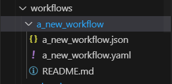

# Change Log

## [0.0.1]

Initial release.

Features:
* Connect to a remote WFM.
* Download the full workflow and action list.
* Create new workflows and actions (with a predefined template).
* Modify and automatically upload workflow changes.
* Validate the format (requires RedHat's YAML extension).
* Retrieve the status from the latest execution.
* Access WFM with the right pointers to workflows and executions.
* Do all abovementioned actions on a local repository (local folder, git).

Issues:
* Minor errors are reported by the vsCode. However, the extension runs without aparent issue. To be reviewed.
* First version. Will require deeper error control.
* `process.env.NODE_TLS_REJECT_UNAUTHORIZED = "0"` disbles SSL verification (not recommended).
* By changing the extension config, the data does not get updated. User needs to reload vsCode to get config updated.
* Local files are always treated as workflows. We need a mechanism to differentiate workflows from actions in local folders.
* In-line validation only works for workflows, not for actions (requires JSON schema for actions).

Roadmap:
* Json-Schema for ad-hoc actions.
* File name ending. Shall we integrate ".yaml" when downloading?
* Support for Jinja templates.
* Running ad-hoc actions.

## [1.0.0]

Updates:
* Port is now configurable to connect to WS NOC WFM
* Handle disconnects from the system (timeouts)

## [1.0.1]

Updates:
* Allow users to configure connection timeouts (default 20 secs)

## [1.1.1]

Updates:
* For unsaved files, we add the compare functionality so the user can see all modifications before saving.
* In settings, the user can define a list of tags to be ignored by the plugin, to reduce the amount of workflows shown in the workflow list. When modified, the user will have to reload the vsCode window.

## [1.1.2]

Updates:
* Hide clear text password in settings.

## [1.1.3]

Updates:
* Removed all compile errors/warnings from source code.
* Added File Extensions to workflow and action files.
* Updated backend logic to proccess the extensions along with the filenames.
* tested functionality with filename extensions.
* files are downladed to the local filesystem with the file extension/type included.
* VsCode extension will only allow you to add/update/rename files with their correct extension.
    - .action for actions
    - .yaml for workflows

## [1.1.4]

Updates:
* Added support for jinja2 templates for the NSP WFM in the extension.
* Users can Create/Update/Delete/Rename templates. 
* Added File Extensions to jinja template files ".jinja".
* Template files are downladed to the local filesystem with the file extension/type included.
* Api call for GET/PUT/UPDATE are parsed so that unecessary metadata is not included in the jinja template file. Only the jinja template (Jinja Code), is what can be modified/read in the file.
* Error Checking: VsCode extension will only allow you to add/update/rename files using their correct respective extension.
    - .action for actions
    - .yaml for workflows
    - .jinja for templates
____

## [2.0.0]

**Updates:**
* Added support for workflow views and documentation.
* Users can read and update workflow views and documentations associated with a workflow.
* The Workflow folder structure has been modified so that each workflow in the workflow folder is a folder with the following scheme:
    - folder: workflow name
        - file: workflow name.json (workflow view)
        - file: workflow name.yaml  (workflow definition)
        - file: README.md (workflow documentation)
____

* Example:

____

* Users can create a workflow by creating a new folder in the 'workflows' directory. Doing this will automatically generate the three workflow files for the workflow definition, view, and documentation.
* Renaming a workflow within its .yaml file definition will automatically create a copy of the workflow folder with the new name applied.
* All previous workflow .yaml functionality is still available with the new workflow folder structure, i.e. execute workflow, validate workflow, last execution result, open workflow in browser etc...

* Error Checking/Restrictions:
    - Users cannot delete any of the workflow files, as each of the files is associateed with the workflow. In order to delete a workflow and its associative files, the user must delete the associative workflow folder.
    - Users cannot rename any of the three workflow files as the name of the view, the definition, and the workflow folder must be the same. Renaming workflows is supported by renaming the associative workflow folder which will automatically rename the workflow files within that folder to match. 
____